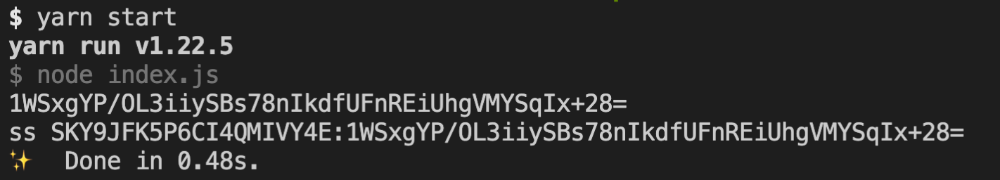

# example-authentication

## 

1. Make sure node and your preferred package manager are installed on your machine
    - Instruction to install Yarn can be found here [ [Mac](https://classic.yarnpkg.com/en/docs/install#mac-stable), [Windows](https://classic.yarnpkg.com/en/docs/install#windows-stable) ]
    - Instructions to install Node.js and npm can be found [here](https://docs.npmjs.com/downloading-and-installing-node-js-and-npm)
2. Clone the repo `git clone https://github.com/skyslope/example-authentication.git`
3. Replace the values in the `.sampleENV` file with your data and rename the file to `.env` (dot env). 
4. Install the modules: dotenv, crypto, moment, and node-fetch: `yarn add dotenv crypto moment node-fetch`
5. Run the script: `yarn start`
6. When `example-authentication` script is successful, an hmac hash and Authorization Header are returned:
    - 
